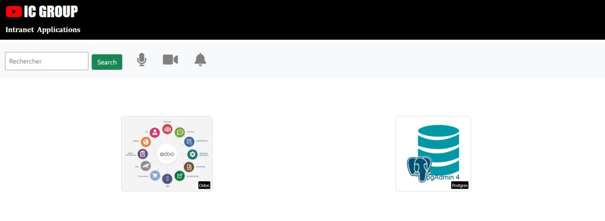
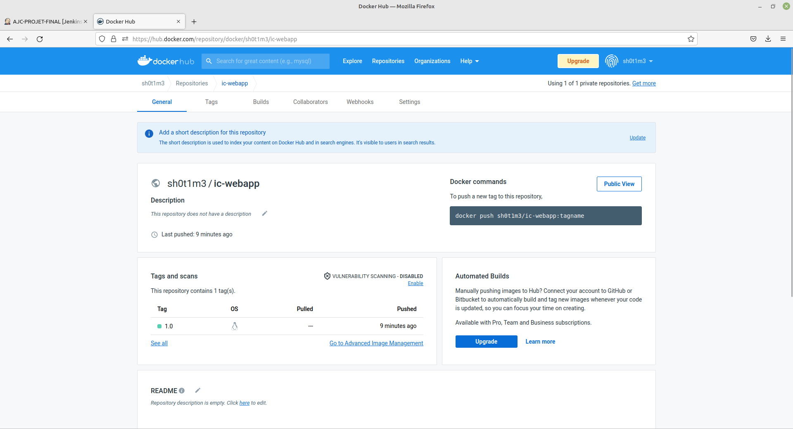
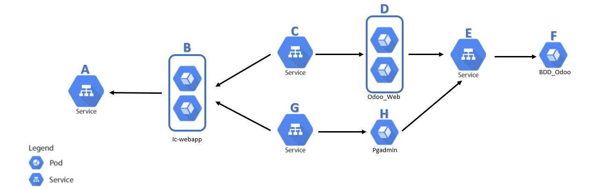
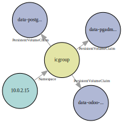
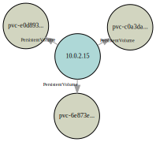
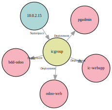
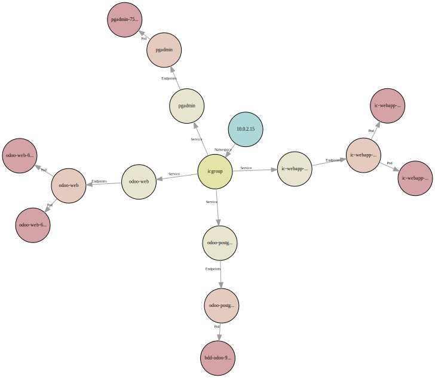

# PROJET FINAL DEVOPS

**Groupe 3**
- Majd EL KHATIB (OP CONSULTING)
- Christophe GARCIA (SPIE ICS Toulouse)
- Romain REVEL (SPIE ICS Grenoble)

---

## Table des matières

---

## Introduction

---

### Contexte

Formation
- chez AJC Formation
- du 25/07/2022 au 13/10/2022
- sur le **DevOps**

Ce document est le rendu du projet final

---

### Rappel du sujet

La société IC GROUP souhaite mettre sur
pied un site **web vitrine** devant permettre d’accéder à ses 02 applications phares: **Odoo** et **pgAdmin**

---

### Analyse du sujet

1)
  * Conteneurisation de la web app python (Flask) avec **Docker**
  * Déploiement des 3 produits sur un cluster **Kubernetes**

2)
  * Mise en place d'un pipeline CI/CD à l'aide de **Jenkins** et de **Ansible**

---

### Méthodologie

2 possibilités:

- Coopération: chacun traite un point particulier de son côté puis mise en commun
- Collaboration: tout le monde se concentre sur le même point particulier

Source: https://www.votre-it-facile.fr/travail-collaboratif-et-travail-cooperatif-difference/

---

### Choix des outils

- Communication (voix / texte / partage d'écran)
  - Discord

- Versionnement
  - Git
  - Github
  - Gitkraken: client Git beau et ergonomique

- Infrastructure
  - Virtualbox
  - Vagrant

---

## Approche Kubernetes

---

### Infrastructure

- Github
  https://github.com/Romain-Revel/ajc-projet-final
- Docker
  https://hub.docker.com/repository/docker/sh0t1m3/ic-webapp
- Kubernetes / Minikube

- Postes: **Windows 10** et **Linux Mint** -> complications

---

### Vagrant
Utilisation d'un fichier Vagrant fourni par Dirane lors de notre formation.
Nous l'avons adapté pour répondre à notre besoin.

```ruby
# Version initiale fonctionnant uniquement sous Windows
Vagrant.configure("2") do |config|
  config.vm.define "docker" do |docker|
    docker.vm.box = "geerlingguy/centos7"
    docker.vm.network "private_network",  type: "static", ip: "192.168.99.11"
    docker.vm.hostname = "docker"
    docker.vm.provider "virtualbox" do |v|
      v.name = "docker"
      v.memory = 1024
      v.cpus = 2
    end
    docker.vm.provision :shell do |shell|
      shell.path = "install_docker.sh"
      shell.env = { 'ENABLE_ZSH' => ENV['ENABLE_ZSH'] }
    end
  end
end
```

---

Comme nous utilisons deux environnements différents, nous avons fait un module dans le fichier vagrant (en ruby). Ce module sera utilisé pour tous les fichiers vagrant qui suivront.

```ruby

# Module pour gérer l'OS hôte
module OS
        def OS.windows?
                (/cygwin|mswin|mingw|bccwin|wince|emx/ =~ RUBY_PLATFORM) != nil
        end
        def OS.mac?
                (/darwin/ =~ RUBY_PLATFORM) != nil
        end
        def OS.unix?
                !OS.windows?
        end
        def OS.linux?
                OS.unix? and not OS.mac?
        end
end
```

---

Voici comment utiliser le module.

```ruby
    # Ajout
    docker.vm.box = "geerlingguy/centos7"
    if OS.linux?
        # Sous linux, il FAUT préciser le nom du réseau hôte
        # https://www.vagrantup.com/docs/providers/virtualbox/networking
        # Dans Virtualbox > Fichier > Gestionnaire de réseau hôte (CTRL + H):
        # - Vérifier la présence de vboxnet0, sinon le créer
        # - Vérifier l'adresse IPv4 et le masque, sinon les modifier (à faire 2 fois pour être pris en compte)
        #
        # Vérifier avec "ip -a" le nom, l'IP et le masque
        docker.vm.network "private_network",  type: "static", ip: "192.168.99.11", name: "vboxnet0"
    elsif OS.windows?
        docker.vm.network "private_network",  type: "static", ip: "192.168.99.11"
    else
        puts 'OS not managed'
    end
    # ...
```

---

### Conteneurisation de la web app

La première étape est de procéder à la conteneurisation de l'application web vitrine.

https://github.com/sadofrazer/ic-webapp.git

Comment l'intégrer dans notre repo git ?
- Copier-coller -> le plus simple
- Git submodules -> trop compliqué et risqué
- Git subtrees -> pas le temps

---

Pour cela un fichier Dockerfile a été créé enfin de générer une image.

```docker
# Dockerfile ic-webapp
FROM alpine:3.6
ENV ODOO_URL=""
ENV PGADMIN_URL=""
# Install python and pip
RUN apk add --no-cache --update python3 py3-pip bash && \
        # Install dependencies
        pip3 install Flask && \
        # Add a Group and user icwebapp
        addgroup -S icwebapp && \
        adduser -S icwebapp -G icwebapp
# Add our code
COPY --chown=icwebapp:icwebapp ic-webapp /opt/ic-webapp/
USER icwebapp
WORKDIR /opt/ic-webapp
EXPOSE 8080
CMD [ "python3", "app.py" ]
```

On peut voir que pour des raisons de bonnes pratiques, nous avons créé un USER (icwebapp) qui lancera l'application.

---

Bien entendu, il faut tester l'application. Afin de répéter les commandes un script a été créé.

```bash
#!/bin/bash
# Script avec les commandes séquentielles
image="ic-webapp"
name="test-ic-webapp"
port="8080"
docker stop ${name} && docker rm ${name}
# Build soit en taggant directement soit en retaggant:
# docker tag SOURCE_IMAGE[:TAG] TARGET_IMAGE[:TAG]
docker build -t sh0t1m3/${image}:1.0 .
docker run -d -p ${port}:${port} \
  -e ODOO_URL='https://www.odoo.com/' \
  -e PGADMIN_URL='https://www.pgadmin.org/' \
  --name=${name} sh0t1m3/${image}:1.0

sleep 3

curl http://localhost:${port}
```

---



---

Une fois l'image construite, et un conteneur créé à partir de cette image a été testé. Nous pouvons publier l'image sur le registry dockerhub.

```bash
#!/bin/bash
# Script de publication et de nettoyage
image="ic-webapp"
name="test-ic-webapp"

docker stop ${name}
docker rm ${name}

docker login
docker push sh0t1m3/${image}:1.0

# docker rmi ${image}
# docker rm $(docker ps -aq)
# docker rmi $(docker images -aq)
```

---



---

### Déploiement avec Kubernetes

Afin de pouvoir déployer la totalité de l'environnement, dans cette approche nous allons utiliser kubernetes (minikube)
On a installé longhorn qui est chargé de gérer les PVs (Persistent Volume)
- Installation de longhorn (avec helm)
- Création des manifests
- Application des manifests

---

#### Helm

Kubernetes package manager : https://helm.sh/

```bash
#!/bin/bash
# Helm installation
HELM_PATH="$(which helm)"

if [ "${HELM_PATH}" == "" ]; then
        # Get HELM
        curl https://get.helm.sh/helm-v3.10.0-linux-amd64.tar.gz -o helm-v3.10.0-linux-amd64.tar.gz
        tar xfz helm-v3.10.0-linux-amd64.tar.gz
        sudo mv linux-amd64/helm /usr/local/bin && chmod +x /usr/local/bin/helm
        rm -Rf tar xfz helm-v3.10.0-linux-amd64.tar.gz linux-amd64/
        HELM_PATH=/usr/local/bin/helm
fi
```

---
#### Longhorn
Cloud native distributed block storage for Kubernetes

```bash
# Longhorn installation with helm
su vagrant -c "${HELM_PATH} repo add longhorn https://charts.longhorn.io"
if [ $? -ne 0 ]; then
        echo "Impossible d'ajouter le repo à helm"
        exit 1
fi

su vagrant -c "${HELM_PATH} repo update"

su vagrant -c "${HELM_PATH} install longhorn longhorn/longhorn --namespace longhorn-system --create-namespace"
if [ $? -ne 0 ]; then
        echo "Impossible d'installer longhorn"
        exit 1
fi
```

---

#### Architecture du namespace




---

#### Les manifests

- Namespace
  ```bash
  kubectl create ns icgroup
  ```

- Secrets
  La génération des secrets doit etre manuelle pour éviter un stockage du mot de passe.

  ```bash
  kubectl create secret generic  odoo-pgsql-password --from-literal=odoo=YOUR_PASSWORD -n icgroup

  kubectl create secret generic  pgadmin --from-literal=pgadmin-password=YOUR_PASSWORD -n icgroup --dry-run=client -o yaml >10-secret_pgadmin.yaml
  ```
---

- Pré-génération des manifestes
Grace à kubectl nous pouvons générer des fichiers .yml à partir de commandes. Voici quelques exemples :

Pour avoir la trame du template container dans le deployment
```bash
kubectl run --image=postgres:13 pod pgsql -n icgroup -l env=prod -l
app=odoo-pgsql --env POSTGRES_DB=postgres --env POSTGRES_USER=odoo
--port=5432 --dry-run=client -o yaml
```

Pour avoir la trame du deployment
```bash
kubectl create deploy bdd-odoo --image postgres:13 -n icgroup
--port=5432 --replicas=1 --dry-run=client -o yaml
```
Pour avoir la trame du service
```bash
 kubectl expose deploy bdd-odoo --port=5433 --type=ClusterIP --target-port=5432 --name=service-bdd -n icgroup --dry-run=client -o yaml
 ```
---

- PVCs (pour les applications où cela est nécessaire)
  - Storageclass Longhorn

```yaml
apiVersion: v1
kind: PersistentVolumeClaim
metadata:
  name: data-postgres-claim
  namespace: icgroup
spec:
  accessModes:
    - ReadWriteOnce
  storageClassName: "longhorn"
  resources:
    requests:
      storage: 2Gi
```
---

<h1><span style="display:block;text-align:center">Liste des PVC</span></h1>

<span style="display:block;text-align:center"></span>

<h1><span style="display:block;text-align:center">Liste des PV générés par longhorn</span></h1>

<span style="display:block;text-align:center"> </span>


---

- Deploiements

Un Deployment fournit des mises à jour déclaratives pour les Pods et les ReplicaSets.
```yaml
apiVersion: apps/v1
kind: Deployment
metadata:
  name: pgadmin
  namespace: icgroup
spec:
  replicas: 1
  selector:
    matchLabels:
      app: pgadmin
      env: prod
```

---

```yaml
  template:
    metadata:
      labels:
        app: pgadmin
        env: prod
    spec:
      securityContext:
        runAsUser: 5050
        runAsGroup: 5050
        fsGroup: 5050
        fsGroupChangePolicy: "OnRootMismatch" 
      volumes:
        - name: pgadmin-config
          configMap:
            name: pgadmin-config
        - name: pgadmin-data
          persistentVolumeClaim:
            claimName: data-pgadmin-claim
```

---

```yaml
      containers:
        - name: pgadmin
#          securityContext:
#            readOnlyRootFilesystem: true      
          image: dpage/pgadmin4:6.14
          env:
            - name: PGADMIN_LISTEN_ADDRESS
              value: 0.0.0.0
            - name: PGADMIN_PORT
              value: "80"
            - name: PGADMIN_DEFAULT_EMAIL
              value: user@domain.com
            - name: PGADMIN_DEFAULT_PASSWORD
              valueFrom:
                secretKeyRef:
                  name: pgadmin
                  key: pgadmin-password
          ports:
            - name: http
              containerPort: 80
              protocol: TCP
          volumeMounts:
            - name: pgadmin-config
              mountPath: /pgadmin4/servers.json
              subPath: servers.json
              readOnly: true
            - name: pgadmin-data
              mountPath: /var/lib/pgadmin
          readinessProbe:
            httpGet:
              path: /
              port: 80
          resources: {}
#            requests:
#              memory: "300Mi"
#              cpu: "100m"
#            limits:
#              memory: "300Mi"
#              cpu: "200m"   
```

---
Le ConfigMap pour le fichier servers.json
```yaml
apiVersion: v1
kind: ConfigMap
metadata:
 name: pgadmin-config
 namespace: icgroup
data:
 servers.json: |
    {
        "Servers": {
                "1": {
                "Name": "Minimally Defined Server",
                "Group": "Server Group 1",
                "Port": 5432,
                "Username": "odoo",
                "Host": "odoo-postgres",
                "SSLMode": "prefer",
                "MaintenanceDB": "postgres"
                }
        }
    }
```

---
<h1><span style="display:block;text-align:center">Liste des déploiements</span></h1>

<span style="display:block;text-align:center"></span>

---
- Services
  - ClusterIP
  - NodePort
  - Loadbalancing(round-robin)

```yaml
apiVersion: v1
kind: Service
metadata:
  creationTimestamp: null
  labels:
     env: prod
     app: ic-webapp
  name: ic-webapp-service
  namespace: icgroup
spec:
  ports:
  - port: 25000
    protocol: TCP
    targetPort: 8080
    nodePort: 31500
  selector:
    env: prod
    app: ic-webapp
  type: NodePort
status:
  loadBalancer: {}
```

---
<h1><span style="display:block;text-align:center">Liste des services</span></h1>

<span style="display:block;text-align:center"></span>

---

<h1><span style="display:block;text-align:center">Schéma complet</span></h1>


---

<h1>Procédure de déploiement : </h1>

- Kubernetes existant

```bash
git clone https://github.com/Romain-Revel/ajc-projet-final-2.git
cd ajc-projet-final-2/manifests
```
Vous pouvez personnalisé l'environnement en modifiant les manifests que ce soit pour les paramètres des conteneurs ou la configuration des services.

Une fois configurée, il suffit de faire :

```bash
./install_app.sh
```

Ce script demandera de rentrer les mots de passes qui devront être utilisés. Celui de la base de données ```postgres``` et de l'utilisateur ```pgadmin``` 

- Avec vagrant
```bash
git clone https://github.com/Romain-Revel/ajc-projet-final-2.git
cd ajc-projet-final-2/infrastructure/ic-webapp
vagrant up
```

Cela installera une VM contenant minikube, longhorn et tout l'environnement de production avec comme mot de passe pour la BDD : odoo et pour pgadmin : pgadmin
Si vous avez besoin de changer ces mots de passe, il faut éditer le script ``` install_app.sh ``` présent dans le répertoire.

---

### La validation des fichiers

  - hooks de pre-commit

---

  - shellcheck pour les scripts d'installation

```bash
shellcheck $(find . -type f -name "*.sh")
```

```bash
In ./infrastructure/docker/install_docker.sh line 14:
if [[ !(-z "$ENABLE_ZSH")  &&  ($ENABLE_ZSH == "true") ]]
       ^-- SC1035: You are missing a required space here.


In ./infrastructure/docker/install_docker.sh line 19:
    su - vagrant  -c  'echo "Y" | sh -c "$(curl -fsSL https://raw.githubusercontent.com/ohmyzsh/ohmyzsh/master/tools/install.sh)"'
                      ^-- SC2016: Expressions don't expand in single quotes, use double quotes for that.


In ./infrastructure/minikube/install_minikube.sh line 15:
sudo curl -LO https://storage.googleapis.com/kubernetes-release/release/`curl -s https://storage.googleapis.com/kubernetes-release/release/stable.txt`/bin/linux/amd64/kubectl
                                                                        ^-- SC2046: Quote this to prevent word splitting.
                                                                        ^-- SC2006: Use $(..) instead of legacy `..`.


In ./infrastructure/minikube/install_minikube.sh line 18:
sudo echo '1' > /proc/sys/net/bridge/bridge-nf-call-iptables
              ^-- SC2024: sudo doesn't affect redirects. Use ..| sudo tee file


In ./infrastructure/minikube/install_minikube.sh line 22:
echo 'source <(kubectl completion bash)' >> ~vagrant/.bashrc
^-- SC2129: Consider using { cmd1; cmd2; } >> file instead of individual redirects.


In ./infrastructure/minikube/install_minikube.sh line 26:
if [[ !(-z "$ENABLE_ZSH")  &&  ($ENABLE_ZSH == "true") ]]
   ^-- SC2039: In POSIX sh, [[ ]] is not supported.
       ^-- SC1035: You are missing a required space here.


In ./infrastructure/minikube/install_minikube.sh line 31:
    su - vagrant  -c  'echo "Y" | sh -c "$(curl -fsSL https://raw.githubusercontent.com/ohmyzsh/ohmyzsh/master/tools/install.sh)"'
                      ^-- SC2016: Expressions don't expand in single quotes, use double quotes for that.
```
---

  - kube-linter pour les manifests
```bash
docker run --rm -v /home/vagrant/ajc-projet-final/manifests/:/dir stackrox/kube-linter lint /dir
```

---
  - hadolint pour le Dockerfile


```bash
docker run --rm -i hadolint/hadolint <ajc-projet-final/ic-webapp/Dockerfile
```

```bash
-:7 DL3013 warning: Pin versions in pip. Instead of `pip install <package>` use `pip install <package>==<version>` or `pip install --requirement <requirements file>`
-:7 DL3018 warning: Pin versions in apk add. Instead of `apk add <package>` use `apk add <package>=<version>`
-:7 DL3042 warning: Avoid use of cache directory with pip. Use `pip install --no-cache-dir <package>`
```
---

## Partie 2

---

## Conclusion

- Approche kubernetes : 
  - Avantages
  - Inconvénients
- Approche pipeline CI/CD avec ansible et docker
  - Avantages
  - Inconvénients