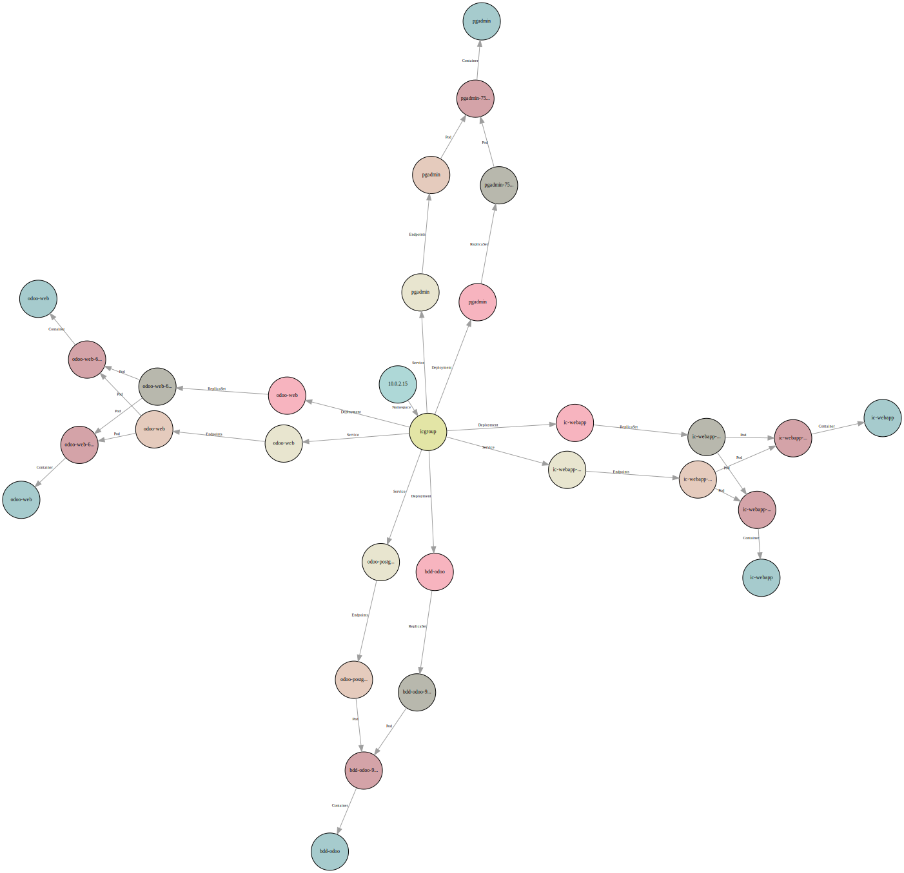

<style>
.toto {
  font-size: 10px
}
</style>
# PROJET FINAL DEVOPS

**Groupe 3**
- Majd EL KHATIB (OP CONSULTING)
- Christophe GARCIA (SPIE ICS Toulouse)
- Romain REVEL (SPIE ICS Grenoble)

---

## Table des matières
1) [Introduction](#2)
  1. [Contexte](#2)
  1. [Rappel du sujet](#2)
  1. [Analyse du sujet](#2)
  1. [Méthodologie](#2)
  1. [Choix des outils](#2)

---

2) [Partie 1 - Kubernetes](#2)
  1. [Infrastructure](#2)
  1. [Vagrant](#2)
  1. [Conteneurisation de la web app](#2)
  1. [Déploiement avec Kubernetes](#2)
    * [Helm](#2)
    * [Longhorn](#2)
    * [Architecture du namespace](#2)
    * [Les manifests](#2)
  1. [Procédure de déploiement](#2)
  1. [La validation des fichiers](#2)

---

3) [Partie 2 - Jenkins et Ansible](#2)
  1) [Mise en place d’un pipeline CI/CD](#2)
  1) [Ansible](#2)
    * [Création des rôles](#2)
    * [Rôle Odoo](#2)
    * [Rôle PgAdmin](#2)
    * [Le Playbook Ansible](#2)
  1) [Jenkins](#2)
    * [Infrastructure](#2)
    * [Script d'installation](#2)
    * [Interface](#2)
    * [Inconvénients](#2)
    * [Automatisation de l'installation](#2)
    * [Plugins par défaut](#2)
    * [Plugins supplémentaires](#2)
    * [jenkins-cli](#2)
    * [Configuration de Jenkins](#2)
    * [Rendre Jenkins accessible avec Ngrok](#2)
    * [Pipeline(s)](#2)
      1) [Structure](#2)
      1) [Lint YAML](#2)
      1) [Lint markdown](#2)
      1) [Lint ansible](#2)
      1) [Lint shell scripts](#2)
      1) [Lint shell scripts - checkstyle](#2)
      1) [Lint docker files](#2)
      1) [Push docker image](#2)
      1) [Déploiement avec Ansible](#2)
      1) [Test final](#2)
      1) [Troubleshooting](#2)
      1) [Trivy](#2)
      1) [Déclenchement automatique](#2)
    1) [Problèmes rencontrés avec Jenkins](#2)
    1) [Astuces](#2)
    1) [TODO](#2)
4) [Conclusion](#2)

---

## Introduction

---

### Contexte

Formation
- chez AJC Formation
- du 25/07/2022 au 13/10/2022
- sur le **DevOps**

Ce document est le rendu du projet final

---

### Rappel du sujet

La société IC GROUP souhaite mettre sur
pied un site **web vitrine** devant permettre d’accéder à ses 02 applications phares: **Odoo** et **pgAdmin**

---

### Analyse du sujet

1)
  * Conteneurisation de la web app python (Flask) avec **Docker**
  * Déploiement des 3 produits sur un cluster **Kubernetes**

2)
  * Mise en place d'un pipeline CI/CD à l'aide de **Jenkins** et de **Ansible**

---

### Méthodologie

2 possibilités:

- Coopération: chacun traite un point particulier de son côté puis mise en commun
- Collaboration: tout le monde se concentre sur le même point particulier

Source: https://www.votre-it-facile.fr/travail-collaboratif-et-travail-cooperatif-difference/

---

### Choix des outils

- Communication (voix / texte / partage d'écran)
  - Discord

- Versionnement
  - Git
  - Github
  - Gitkraken: client Git beau et ergonomique

- Infrastructure
  - Virtualbox
  - Vagrant

---

## Approche Kubernetes

---

### Infrastructure

- Github
  https://github.com/Romain-Revel/ajc-projet-final
- Docker
  https://hub.docker.com/repository/docker/sh0t1m3/ic-webapp
- Kubernetes / Minikube

- Postes: **Windows 10** et **Linux Mint** -> complications

---

### Vagrant
Utilisation d'un fichier Vagrant fourni par Dirane lors de notre formation.
Nous l'avons adapté pour répondre à notre besoin.

```ruby
# Version initiale fonctionnant uniquement sous Windows
Vagrant.configure("2") do |config|
  config.vm.define "docker" do |docker|
    docker.vm.box = "geerlingguy/centos7"
    docker.vm.network "private_network",  type: "static", ip: "192.168.99.11"
    docker.vm.hostname = "docker"
    docker.vm.provider "virtualbox" do |v|
      v.name = "docker"
      v.memory = 1024
      v.cpus = 2
    end
    docker.vm.provision :shell do |shell|
      shell.path = "install_docker.sh"
      shell.env = { 'ENABLE_ZSH' => ENV['ENABLE_ZSH'] }
    end
  end
end
```

---

Comme nous utilisons deux environnements différents, nous avons fait un module dans le fichier vagrant (en ruby). Ce module sera utilisé pour tous les fichiers vagrant qui suivront.

```ruby

# Module pour gérer l'OS hôte
module OS
        def OS.windows?
                (/cygwin|mswin|mingw|bccwin|wince|emx/ =~ RUBY_PLATFORM) != nil
        end
        def OS.mac?
                (/darwin/ =~ RUBY_PLATFORM) != nil
        end
        def OS.unix?
                !OS.windows?
        end
        def OS.linux?
                OS.unix? and not OS.mac?
        end
end
```

---

Voici comment utiliser le module.

```ruby
    # Ajout
    docker.vm.box = "geerlingguy/centos7"
    if OS.linux?
        # Sous linux, il FAUT préciser le nom du réseau hôte
        # https://www.vagrantup.com/docs/providers/virtualbox/networking
        # Dans Virtualbox > Fichier > Gestionnaire de réseau hôte (CTRL + H):
        # - Vérifier la présence de vboxnet0, sinon le créer
        # - Vérifier l'adresse IPv4 et le masque, sinon les modifier (à faire 2 fois pour être pris en compte)
        #
        # Vérifier avec "ip -a" le nom, l'IP et le masque
        docker.vm.network "private_network",  type: "static", ip: "192.168.99.11", name: "vboxnet0"
    elsif OS.windows?
        docker.vm.network "private_network",  type: "static", ip: "192.168.99.11"
    else
        puts 'OS not managed'
    end
    # ...
```

---

### Conteneurisation de la web app

La première étape est de procéder à la conteneurisation de l'application web vitrine.

https://github.com/sadofrazer/ic-webapp.git

Comment l'intégrer dans notre repo git ?
- Copier-coller -> le plus simple
- Git submodules -> trop compliqué et risqué
- Git subtrees -> pas le temps

---

Pour cela un fichier Dockerfile a été créé enfin de générer une image.

```docker
# Dockerfile ic-webapp
FROM alpine:3.6
ENV ODOO_URL=""
ENV PGADMIN_URL=""
# Install python and pip
RUN apk add --no-cache --update python3 py3-pip bash && \
        # Install dependencies
        pip3 install Flask && \
        # Add a Group and user icwebapp
        addgroup -S icwebapp && \
        adduser -S icwebapp -G icwebapp
# Add our code
COPY --chown=icwebapp:icwebapp ic-webapp /opt/ic-webapp/
USER icwebapp
WORKDIR /opt/ic-webapp
EXPOSE 8080
CMD [ "python3", "app.py" ]
```

On peut voir que pour des raisons de bonnes pratiques, nous avons créé un USER (icwebapp) qui lancera l'application.

---

Bien entendu, il faut tester l'application. Afin de répéter les commandes un script a été créé.

```bash
#!/bin/bash
# Script avec les commandes séquentielles
image="ic-webapp"
name="test-ic-webapp"
port="8080"
docker stop ${name} && docker rm ${name}
# Build soit en taggant directement soit en retaggant:
# docker tag SOURCE_IMAGE[:TAG] TARGET_IMAGE[:TAG]
docker build -t sh0t1m3/${image}:1.0 .
docker run -d -p ${port}:${port} \
  -e ODOO_URL='https://www.odoo.com/' \
  -e PGADMIN_URL='https://www.pgadmin.org/' \
  --name=${name} sh0t1m3/${image}:1.0

sleep 3

curl http://localhost:${port}
```

---


---

Une fois l'image construite, et un conteneur créé à partir de cette image a été testé. Nous pouvons publier l'image sur le registry dockerhub.

```bash
#!/bin/bash
# Script de publication et de nettoyage
image="ic-webapp"
name="test-ic-webapp"

docker stop ${name}
docker rm ${name}

docker login
docker push sh0t1m3/${image}:1.0

# docker rmi ${image}
# docker rm $(docker ps -aq)
# docker rmi $(docker images -aq)
```

---


---

### Déploiement avec Kubernetes

Afin de pouvoir déployer la totalité de l'environnement, dans cette approche nous allons utiliser kubernetes (minikube)
On a installé longhorn qui est chargé de gérer les PVs (Persistent Volume)
- Installation de longhorn (avec helm)
- Création des manifests
- Application des manifests

---

#### Helm

Kubernetes package manager : https://helm.sh/

```bash
#!/bin/bash
# Helm installation
HELM_PATH="$(which helm)"

if [ "${HELM_PATH}" == "" ]; then
        # Get HELM
        curl https://get.helm.sh/helm-v3.10.0-linux-amd64.tar.gz -o helm-v3.10.0-linux-amd64.tar.gz
        tar xfz helm-v3.10.0-linux-amd64.tar.gz
        sudo mv linux-amd64/helm /usr/local/bin && chmod +x /usr/local/bin/helm
        rm -Rf tar xfz helm-v3.10.0-linux-amd64.tar.gz linux-amd64/
        HELM_PATH=/usr/local/bin/helm
fi
```

---
#### Longhorn
Cloud native distributed block storage for Kubernetes

```bash
# Longhorn installation with helm
su vagrant -c "${HELM_PATH} repo add longhorn https://charts.longhorn.io"
if [ $? -ne 0 ]; then
        echo "Impossible d'ajouter le repo à helm"
        exit 1
fi

su vagrant -c "${HELM_PATH} repo update"

su vagrant -c "${HELM_PATH} install longhorn longhorn/longhorn --namespace longhorn-system --create-namespace"
if [ $? -ne 0 ]; then
        echo "Impossible d'installer longhorn"
        exit 1
fi
```

---

#### Architecture du namespace


---
<!-- _class: toto -->
#### Les manifests

- Namespace
  ```bash
  kubectl create ns icgroup
  ```

- Secrets
  La génération des secrets doit etre manuelle pour éviter un stockage du mot de passe.

  ```bash
  kubectl create secret generic  odoo-pgsql-password --from-literal=odoo=YOUR_PASSWORD -n icgroup

  kubectl create secret generic  pgadmin --from-literal=pgadmin-password=YOUR_PASSWORD -n icgroup --dry-run=client -o yaml >10-secret_pgadmin.yaml
  ```

- Pré-génération des manifestes:

---
<!-- _class: toto -->

Trame du template container dans le deployment
```bash
kubectl run --image=postgres:13 pod pgsql -n icgroup -l env=prod -l
app=odoo-pgsql --env POSTGRES_DB=postgres --env POSTGRES_USER=odoo
--port=5432 --dry-run=client -o yaml
```

Trame du deployment
```bash
kubectl create deploy bdd-odoo --image postgres:13 -n icgroup
--port=5432 --replicas=1 --dry-run=client -o yaml
```

Trame du service
```bash
kubectl expose deploy bdd-odoo --port=5433 --type=ClusterIP --target-port=5432 --name=service-bdd -n icgroup --dry-run=client -o yaml
```

---

- PVCs (pour les applications où cela est nécessaire)
  - Storageclass Longhorn

```yaml
apiVersion: v1
kind: PersistentVolumeClaim
metadata:
  name: data-postgres-claim
  namespace: icgroup
spec:
  accessModes:
    - ReadWriteOnce
  storageClassName: "longhorn"
  resources:
    requests:
      storage: 2Gi
```

---

Liste des PVC


                           Liste des PV générés par longhorn

---

- Deploiements

Un **Deployment** fournit des mises à jour déclaratives pour les **Pods** et les **ReplicaSets**.

```yaml
apiVersion: apps/v1
kind: Deployment
metadata:
  name: pgadmin
  namespace: icgroup
spec:
  replicas: 1
  selector:
    matchLabels:
      app: pgadmin
      env: prod
```

---

```yaml
  template:
    metadata:
      labels:
        app: pgadmin
        env: prod
    spec:
      securityContext:
        runAsUser: 5050
        runAsGroup: 5050
        fsGroup: 5050
        fsGroupChangePolicy: "OnRootMismatch" 
      volumes:
        - name: pgadmin-config
          configMap:
            name: pgadmin-config
        - name: pgadmin-data
          persistentVolumeClaim:
            claimName: data-pgadmin-claim
```

---

```yaml
      containers:
        - name: pgadmin
#          securityContext:
#            readOnlyRootFilesystem: true      
          image: dpage/pgadmin4:6.14
          env:
            - name: PGADMIN_LISTEN_ADDRESS
              value: 0.0.0.0
            - name: PGADMIN_PORT
              value: "80"
            - name: PGADMIN_DEFAULT_EMAIL
              value: user@domain.com
            - name: PGADMIN_DEFAULT_PASSWORD
              valueFrom:
                secretKeyRef:
                  name: pgadmin
                  key: pgadmin-password
          ports:
            - name: http
              containerPort: 80
              protocol: TCP
          volumeMounts:
            - name: pgadmin-config
              mountPath: /pgadmin4/servers.json
              subPath: servers.json
              readOnly: true
            - name: pgadmin-data
              mountPath: /var/lib/pgadmin
          readinessProbe:
            httpGet:
              path: /
              port: 80
          resources: {}
#            requests:
#              memory: "300Mi"
#              cpu: "100m"
#            limits:
#              memory: "300Mi"
#              cpu: "200m"   
```

---

Le ConfigMap pour le fichier servers.json
```yaml
apiVersion: v1
kind: ConfigMap
metadata:
 name: pgadmin-config
 namespace: icgroup
data:
 servers.json: |
    {
        "Servers": {
                "1": {
                "Name": "Minimally Defined Server",
                "Group": "Server Group 1",
                "Port": 5432,
                "Username": "odoo",
                "Host": "odoo-postgres",
                "SSLMode": "prefer",
                "MaintenanceDB": "postgres"
                }
        }
    }
```

---

Liste des déploiements


---

- Services
  - ClusterIP
  - NodePort
  - Loadbalancing(round-robin)

---

```yaml
apiVersion: v1
kind: Service
metadata:
  creationTimestamp: null
  labels:
     env: prod
     app: ic-webapp
  name: ic-webapp-service
  namespace: icgroup
spec:
  ports:
  - port: 25000
    protocol: TCP
    targetPort: 8080
    nodePort: 31500
  selector:
    env: prod
    app: ic-webapp
  type: NodePort
status:
  loadBalancer: {}
```

---

Liste des services


---

Schéma complet



---

### Procédure de déploiement

- Kubernetes existant

```bash
git clone https://github.com/Romain-Revel/ajc-projet-final-2.git
cd ajc-projet-final-2/manifests
```
Vous pouvez personnalisé l'environnement en modifiant les manifests que ce soit pour les paramètres des conteneurs ou la configuration des services.

Une fois configurée, il suffit de faire :

```bash
./install_app.sh
```

Ce script demandera de rentrer les mots de passes qui devront être utilisés. Celui de la base de données ```postgres``` et de l'utilisateur ```pgadmin``` 

---

- Avec vagrant
```bash
git clone https://github.com/Romain-Revel/ajc-projet-final-2.git
cd ajc-projet-final-2/infrastructure/ic-webapp
vagrant up
```

Cela installera une VM contenant minikube, longhorn et tout l'environnement de production avec comme mot de passe pour la BDD : odoo et pour pgadmin : pgadmin
Si vous avez besoin de changer ces mots de passe, il faut éditer le script ``` install_app.sh ``` présent dans le répertoire.

---

### La validation des fichiers

  - hooks de pre-commit

---

  - shellcheck pour les scripts d'installation

```bash
shellcheck $(find . -type f -name "*.sh")
```

```bash
In ./infrastructure/docker/install_docker.sh line 14:
if [[ !(-z "$ENABLE_ZSH")  &&  ($ENABLE_ZSH == "true") ]]
       ^-- SC1035: You are missing a required space here.


In ./infrastructure/docker/install_docker.sh line 19:
    su - vagrant  -c  'echo "Y" | sh -c "$(curl -fsSL https://raw.githubusercontent.com/ohmyzsh/ohmyzsh/master/tools/install.sh)"'
                      ^-- SC2016: Expressions don't expand in single quotes, use double quotes for that.


In ./infrastructure/minikube/install_minikube.sh line 15:
sudo curl -LO https://storage.googleapis.com/kubernetes-release/release/`curl -s https://storage.googleapis.com/kubernetes-release/release/stable.txt`/bin/linux/amd64/kubectl
                                                                        ^-- SC2046: Quote this to prevent word splitting.
                                                                        ^-- SC2006: Use $(..) instead of legacy `..`.


In ./infrastructure/minikube/install_minikube.sh line 18:
sudo echo '1' > /proc/sys/net/bridge/bridge-nf-call-iptables
              ^-- SC2024: sudo doesn't affect redirects. Use ..| sudo tee file


In ./infrastructure/minikube/install_minikube.sh line 22:
echo 'source <(kubectl completion bash)' >> ~vagrant/.bashrc
^-- SC2129: Consider using { cmd1; cmd2; } >> file instead of individual redirects.


In ./infrastructure/minikube/install_minikube.sh line 26:
if [[ !(-z "$ENABLE_ZSH")  &&  ($ENABLE_ZSH == "true") ]]
   ^-- SC2039: In POSIX sh, [[ ]] is not supported.
       ^-- SC1035: You are missing a required space here.


In ./infrastructure/minikube/install_minikube.sh line 31:
    su - vagrant  -c  'echo "Y" | sh -c "$(curl -fsSL https://raw.githubusercontent.com/ohmyzsh/ohmyzsh/master/tools/install.sh)"'
                      ^-- SC2016: Expressions don't expand in single quotes, use double quotes for that.
```
---

  - kube-linter pour les manifests
```bash
docker run --rm -v /home/vagrant/ajc-projet-final/manifests/:/dir stackrox/kube-linter lint /dir
```

---
  - hadolint pour le Dockerfile


```bash
docker run --rm -i hadolint/hadolint <ajc-projet-final/ic-webapp/Dockerfile
```

```bash
-:7 DL3013 warning: Pin versions in pip. Instead of `pip install <package>` use `pip install <package>==<version>` or `pip install --requirement <requirements file>`
-:7 DL3018 warning: Pin versions in apk add. Instead of `apk add <package>` use `apk add <package>=<version>`
-:7 DL3042 warning: Avoid use of cache directory with pip. Use `pip install --no-cache-dir <package>`
```
---

## Partie 2

---
### Mise en place d’un pipeline CI/CD

<<<<<<< HEAD


=======
>>>>>>> 4c68270b3359b5137682bdbe84deece31fae5409
---

### Ansible

---

<<<<<<< HEAD


### Création des Rôles Ansible

Déployer des conteneurs docker avec 2 rôles : 

- odoo_role : lance 2 conteneurs celui de odoo et celui de la base de donnée postgres
- pgadmin_role :  lance le site vitrine ic-webapp et un conteneur pgadmin pour visualiser la base de donnée postgres de odoo

---

### Rôle Odoo
Déploye 2 conteneurs avec le template docker-compose:
=======
#### Création des Rôles Ansible

Déployer des conteneurs docker avec 2 rôles  : 

- odoo_role : lance 1 conteneur **odoo** et 1 **postgres**
- pgadmin_role :  lance le site vitrine **ic-webapp** et un conteneur **pgadmin**

**NB :** Toutes les données sont variabilisées donc pourront être surchargée par ansible

**NB :** Il faudrait par la suite passer par un rôle de ansible galaxy 
    https://galaxy.ansible.com/geerlingguy/docker

---

#### Rôle Odoo

Déploie 2 conteneurs avec le template docker-compose  :
>>>>>>> 4c68270b3359b5137682bdbe84deece31fae5409
- Conteneur odoo
- Conteneur postgres

---

templates/docker-compose.yml.j2

<<<<<<< HEAD
```bash

services:

=======
```yaml
# Template docker-compose for odoo
version: '3.3'
services:
>>>>>>> 4c68270b3359b5137682bdbe84deece31fae5409
    {{ SERVICE_POSTGRES }}:
        environment:
            - 'POSTGRES_USER={{ DB_USER }}'
            - 'POSTGRES_PASSWORD={{ DB_PASS }}'
            - 'POSTGRES_DB={{ DB_NAME }}'
        networks:
            - {{ NETWORK_NAME }}
        volumes:
            - 'pgdata:{{ MOUNT_POINT_POSTGRES }}'
        container_name: {{ CONTAINER_NAME_POSTGRES }}
        image: 'postgres:13'
        ports:
            - '{{ POSTGRES_PORT }}:5432'
<<<<<<< HEAD
=======
```

---

```yaml
>>>>>>> 4c68270b3359b5137682bdbe84deece31fae5409
    {{ SERVICE_ODOO }}:
        depends_on:
            - {{ SERVICE_POSTGRES }}
        ports:
            - '{{ ODOO_PORT }}:8069'
        container_name: {{ CONTAINER_NAME_ODOO }}
        networks:
            - {{ NETWORK_NAME }}
        volumes:
            - 'odoo-web-data:/var/lib/odoo'
        environment:
            - 'USER={{ DB_USER }}'
            - 'PASSWORD={{ DB_PASS }}'
            - 'HOST={{ DB_NAME }}'
        image: odoo:13
<<<<<<< HEAD

=======
>>>>>>> 4c68270b3359b5137682bdbe84deece31fae5409
volumes:
    odoo-web-data:
    pgdata:
networks:
    {{ NETWORK_NAME }}:
      driver: bridge
```

---
<<<<<<< HEAD

templates/docker-compose.yml.j2


---

defaults/main.yml

=======
defaults/main.yml

``` yaml
# defaults file for odoo_role

DB_USER: "odoo"
DB_PASS: "odoo"
DB_NAME: "postgres"
POSTGRES_PORT: "5432"
ODOO_PORT: "8081"
IC_PORT: "80"
HOST_IP: "192.168.99.20"
SERVICE_POSTGRES: "postgres"
SERVICE_ODOO: "odoo"
NETWORK_NAME: "ic_network"
CONTAINER_NAME_POSTGRES: "postgres"
CONTAINER_NAME_ODOO: "odoo"
MOUNT_POINT_POSTGRES: "/var/lib/postgresql/data"
```
>>>>>>> 4c68270b3359b5137682bdbe84deece31fae5409
---

tasks/main.yml

<<<<<<< HEAD
---

### Rôle PgAdmin

---

Déploye deux conteneurs via le template docker-compose :
=======
```yaml
# tasks file for odoo_role

- name: creation un repertoire files
  file:
    path: "/home/{{ ansible_user }}/files/"
    recurse: yes
    state: directory
- name: generer un fichier docker-compose
  template:
    src: "docker-compose.yml.j2"
    dest: "/home/{{ ansible_user }}/files/docker-compose.yml"
- name: "Deploiement"
  command: "docker-compose up -d"
  args:
    chdir: "/home/{{ ansible_user }}/files"
```

---

#### Rôle PgAdmin

Déploie deux conteneurs via les templates docker-compose et servers :
>>>>>>> 4c68270b3359b5137682bdbe84deece31fae5409

- pgadmin
- ic-webapp

----

templates/docker-compose.yml.j2

<<<<<<< HEAD
=======
```yaml
# Template docker-compose for pgadmin and ic-webapp
version: '3.3'
services:
    {{ SERVICE_PGADMIN }}:
        container_name: {{ CONTAINER_NAME_PGADMIN }}
        image: dpage/pgadmin4
        networks:
            - {{ NETWORK_NAME }}
        environment:
            - 'PGADMIN_DEFAULT_EMAIL={{ PGADMIN_EMAIL }}'
            - 'PGADMIN_DEFAULT_PASSWORD={{ PGADMIN_PASS }}'
        ports:
            - "{{ PGADMIN_PORT }}:80"
        volumes:
            - /home/{{ ansible_user }}/files/servers.json:/pgadmin4/servers.json
            - 'pgadmin_data:/var/lib/pgadmin'
    {{ SERVICE_ICWEBAPP }}:
        container_name: {{ CONTAINER_NAME_ICWEBAPP }}
        ports:
            - "{{ IC_PORT }}:8080"
        environment:
            - "ODOO_URL=http://{{ POSTGRES_IP }}:{{ ODOO_PORT }}/"
            - "PGADMIN_URL=http://{{ HOST_IP }}:{{ PGADMIN_PORT }}/"
        image: '{{ IMAGE_NAME }}:{{ IMAGE_TAG }}'
        networks:
            - {{ NETWORK_NAME }}
volumes:
    pgadmin_data:
networks:
    {{ NETWORK_NAME }}:
      driver: bridge
 ```

---

servers.json.j2

```json
{
    "Servers": {
        "1": {
            "Name": "{{ DB_NAME }}",
            "Group": "docker_postgres_group_1",
            "Port": {{ POSTGRES_PORT }},
            "Username": "{{ DB_USER }}",
            "Host": "{{ POSTGRES_IP }}",
            "SSLMode": "prefer",
            "MaintenanceDB": "{{ DB_NAME }}"
        }
    }
}
```
**ATTENTION :** Le port de Postgre **DOIT** être **numérique**
>>>>>>> 4c68270b3359b5137682bdbe84deece31fae5409

---

defaults/main.yml

<<<<<<< HEAD
=======
```yaml
# defaults file for pgadmin_role
PGADMIN_EMAIL: "user@domain.com"
PGADMIN_PASS: "odoo_pgadmin_password"
PGADMIN_PORT: "8082"
DB_USER: "odoo"
DB_PASS: "odoo"
DB_NAME: "postgres"
POSTGRES_PORT: "5432"
ODOO_PORT: "8081"
IC_PORT: "80"
HOST_IP: "192.168.99.21"
POSTGRES_IP: "192.168.99.20"
IMAGE_NAME: "sh0t1m3/ic-webapp"
IMAGE_TAG: "1.0"
SERVICE_PGADMIN: "pgadmin"
SERVICE_ICWEBAPP: "ic-webapp"
NETWORK_NAME: "ic_network"
CONTAINER_NAME_PGADMIN: "pgadmin"
CONTAINER_NAME_ICWEBAPP: "ic-webapp"
```
>>>>>>> 4c68270b3359b5137682bdbe84deece31fae5409
---

tasks/main.yml

<<<<<<< HEAD
---

=======
```yaml
- name: creation repertoire files
  file:
    path: "/home/{{ ansible_user }}/files/"
    recurse: yes
    state: directory
- name: générer docker-compose
  template:
    src: "docker-compose.yml.j2"
    dest: "/home/{{ ansible_user }}/files/docker-compose.yml"

- name: pgadmin config file servers
  template:
    src: "servers.json.j2"
    dest: "/home/{{ ansible_user }}/files/servers.json"

- name: "Deploiement"
  command: "docker-compose up -d"
  args:
    chdir: "/home/{{ ansible_user }}/files"
```
---

#### Le Playbook Ansible

Un playbook Ansible est un modèle de tâches d'automatisation. Les playbooks Ansible sont exécutés sur un ensemble, un groupe ou une classification d'hôtes, qui forment ensemble un inventaire.

Source: https://www.redhat.com/fr/topics/automation/what-is-an-ansible-playbook

---

play.yml

```yaml
# Notre playbook 
- name: "installation de odoo"
  hosts: prod-odoo
  roles:
    - role: odoo_role
- name: "Installation de pgadmin"
  hosts: prod-pgadmin
  roles:
    - role: pgadmin_role
```    

---

prods.yml

```yaml
# L'inventaire
all:
  children:
    prod-odoo:
      hosts:
        docker-odoo:
    prod-pgadmin:
      hosts:
        docker-pgadmin-icwebapp:
```

---

La structure de notre répertoire Ansible

```yaml
├── group_vars
│   ├── prod-odoo.yml
│   └── prod-pgadmin.yml
├── host_vars
│   ├── docker-odoo.yml
│   └── docker-pgadmin-icwebapp.yml
├── play.yml
├── prods.yml
└── roles
    ├── odoo_role
    └── pgadmin_role
```

---

```yaml
└── roles
    ├── odoo_role
    │   ├── defaults
    │   │   └── main.yml
    │   ├── handlers
    │   │   └── main.yml
    │   ├── meta
    │   │   └── main.yml
    │   ├── README.md
    │   ├── tasks
    │   │   └── main.yml
    │   ├── templates
    │   │   └── docker-compose.yml.j2
    │   ├── tests
    │   │   ├── inventory
    │   │   └── test.yml
    │   └── vars
    │       └── main.yml
```

---

# Jenkins

---

## Infrastructure

- Serveur 1 : **192.168.99.12** Jenkins
    https://github.com/sadofrazer/jenkins-frazer.git
- Serveur 2 : **192.168.99.21** Applications web site vitrine + pgadmin4
- Serveur 3 : **192.168.99.20** Application Odoo (PostgreSQL)

---

Serveurs 2 et 3 - boucle

```ruby
Vagrant.configure("2") do |config|
  array = ["odoo", "pgadmin-icwebapp"]
  # Boucle pour créer les 2
  array.each_with_index do |val, index|
        config.vm.define "docker-#{val}" do |docker|
                #...
                    docker.vm.network "private_network",  type: "static", ip: "192.168.99.2#{index}", name: "vboxnet0"
                #...
                        docker.vm.network "private_network",  type: "static", ip: "192.168.99.2#{index}"
                #...
                docker.vm.hostname = "docker-#{val}"
                #...
                        v.name = "docker-#{val}"
                #...
```

---

## Jenkins - Script d'installation

```bash
#!/bin/bash
# Script d'installation de Jenkins fourni par Dirane
yum -y update
yum -y install epel-release
# install ansible
yum -y install ansible
# retrieve ansible code
yum -y install git
git clone https://github.com/diranetafen/cursus-devops.git
cd cursus-devops/ansible
ansible-galaxy install -r roles/requirements.yml
ansible-playbook install_docker.yml
sudo usermod -aG docker vagrant
cd ../jenkins
/usr/local/bin/docker-compose up -d
echo "For this Stack, you will use $(ip -f inet addr show enp0s8 | \
sed -En -e 's/.*inet ([0-9.]+).*/\1/p') IP Address"
```

---

## Interface


---

## Jenkins - Inconvénients

- Version datée
- Interface web **laide** et **non ergonomique**
- Les installations ne partagent pas:
    - Comptes
    - Plugins
    - Jobs
    - Secrets
    - Configuration globale

---

## Jenkins-custom - Automatisation de l'installation

- Docker
- jenkins/jenkins:lts-jdk11

---

```docker
FROM jenkins/jenkins:lts-jdk11
USER root
ENV JAVA_OPTS -Djenkins.install.runSetupWizard=false
ENV CASC_JENKINS_CONFIG /var/jenkins_home/jenkins.casc.yml
# Installation
RUN apt-get update && \
    apt-get install -qy curl python3 python3-pip sshpass shellcheck && \
    pip3 install ansible && \
    curl -sSL https://get.docker.com/ | sh
USER jenkins
# Plugins Jenkins
COPY jenkins.plugins.txt /usr/share/jenkins/ref/jenkins.plugins.txt
RUN jenkins-plugin-cli --list && \
    jenkins-plugin-cli --plugin-file /usr/share/jenkins/ref/jenkins.plugins.txt && \
    jenkins-plugin-cli --list
# Configuration as code Jenkins
COPY jenkins.casc.yml /var/jenkins_home/jenkins.casc.yml
```

---

## Plugins par défaut

```text
antisamy-markup-formatter:latest
build-timeout:latest
cloudbees-folder:latest
credentials-binding:latest
email-ext:latest
git:latest
github-branch-source:latest
mailer:latest
pam-auth:latest
pipeline-github-lib:latest
pipeline-stage-view:latest
ssh-slaves:latest
timestamper:latest
workflow-aggregator:latest
ws-cleanup:latest
```

---

## Plugins supplémentaires

```text
ansible:latest
authorize-project:latest
configuration-as-code:latest
docker-plugin:latest
docker-workflow:latest
matrix-auth:latest
```

---


---

## jenkins-cli

- https://www.jenkins.io/doc/book/managing/cli/

- https://medium.com/@muku.hbti/export-import-jenkins-job-and-their-plugins-53cafa5869fa

- https://www.digitalocean.com/community/tutorials/how-to-automate-jenkins-setup-with-docker-and-jenkins-configuration-as-code

---

```bash
#/bin/bash
# Téléchargement de jenkins-cli
if [[ -z "${JENKINS_USERNAME}" ]]; then
    echo "La variable JENKINS_USERNAME n'existe pas. Veuillez l'exporter.";
    exit 1;
fi
if [[ -z "${JENKINS_PASSWORD}" ]]; then
    echo "La variable JENKINS_PASSWORD n'existe pas. Veuillez l'exporter.";
    exit 1;
fi
# Valeurs par défaut
[[ ! -z "${JENKINS_IP}" ]] || JENKINS_IP="192.168.99.13";
[[ ! -z "${JENKINS_PORT}" ]] || JENKINS_PORT="8080";
URL="http://${JENKINS_IP}:${JENKINS_PORT}";
JOB_NAME="TEST";
# Téléchargement de la cli jenkins
if [[ ! -f "jenkins-cli.jar" ]]; then
    wget "${URL}/jnlpJars/jenkins-cli.jar";
fi
```

---

```bash
# Pour lister les jobs
java -jar jenkins-cli.jar -s "${URL}" -auth "${JENKINS_USERNAME}":"${JENKINS_PASSWORD}" list-jobs;

# Récupérer la liste de tous les jobs et les exporter
JOBS=$(java -jar jenkins-cli.jar -s "${URL}" -auth "${JENKINS_USERNAME}":"${JENKINS_PASSWORD}" list-jobs);
mkdir -p "jobs";
for JOB_NAME in $JOBS
do
    java -jar jenkins-cli.jar -s "${URL}" -auth "${JENKINS_USERNAME}":"${JENKINS_PASSWORD}" get-job "${JOB_NAME}" > "jobs/${JOB_NAME}.xml";
done
```

---

```bash
# Restaurer tous les jobs
for JOB_FILE in $(cd "jobs"; ls *.xml)
do
    # echo $JOB_FILE
    # echo ${JOB_FILE%%.xml}
    java -jar jenkins-cli.jar -s "${URL}" -auth "${JENKINS_USERNAME}":"${JENKINS_PASSWORD}" create-job "${JOB_FILE%%.xml}" < "jobs/${JOB_FILE}"
done
```

---

## Configuration de Jenkins

Plugin [Configuration as code](https://plugins.jenkins.io/configuration-as-code/)
- Compte(s) admin
- URL
- Credentials
- Security (bonus)

---

```groovy
jenkins:
  securityRealm:
    local:
      allowsSignup: false
      enableCaptcha: false
      users:
        - id: admin
          password: password
          properties:
          - "apiToken"
          - mailer:
              emailAddress: "admin@hotmail.fr"
          - preferredProvider:
              providerId: "default"
```

---

```groovy
unclassified:
  location:
    url: http://192.168.99.13:8080/
```

---

```groovy
credentials:
  system:
    domainCredentials:
    - credentials:
      - string:
          description: "Token dockerhub"
          id: "dockerhub"
          scope: GLOBAL
          secret: "{AQAAABAAAAAw632BD8V0u3jO0s90yYiMwllBr6OzIrtmGMqWAEvtIDcqXa2XCyH2WBJPrmSdH9fPnShuX2v4AMjjUbicqwo2Ag==}"
      - usernamePassword:
          id: "ansible_user_credentials"
          password: "vagrant"
          scope: GLOBAL
          username: "vagrant"
          usernameSecret: true
      - usernamePassword:
          id: "pgadmin_credentials"
          password: "pgadmin"
          scope: GLOBAL
          username: "pgadmin@local.domain" // @ Très important
          usernameSecret: true
```

---

```groovy
jenkins:
  //...
  authorizationStrategy:
    globalMatrix:
      permissions:
        - "USER:Overall/Administer:admin"
        - "GROUP:Overall/Read:authenticated"
  remotingSecurity:
      enabled: true

security:
  queueItemAuthenticator:
    authenticators:
    - global:
        strategy: triggeringUsersAuthorizationStrategy
```

---

### Rendre Jenkins accessible avec Ngrok

Ngrok est un reverse-proxy qui permet d'ouvrir sur internet des ports d'une machine

Utilisé pour la partie **webhook**

Alternatives à ngrok:

- Vagrant share
    <https://www.vagrantup.com/docs/share>

- Localtunnel
    <https://github.com/localtunnel/localtunnel>

---

```bash
#!/bin/bash
# Script d'installation et de lancement de ngrok
FILE_NAME="ngrok-v3-stable-linux-amd64.tgz";
if [[ ! -f "/usr/local/bin/ngrok" ]]; then
    # Téléchargement
    # https://ngrok.com/download
    if [[ ! -f "${FILE_NAME}" ]]; then
        wget "https://bin.equinox.io/c/bNyj1mQVY4c/${FILE_NAME}";
    fi

    # Décompression et installation
    sudo tar xvzf "${FILE_NAME}" -C /usr/local/bin;
fi
sleep 3
# Enregistrement
ngrok config add-authtoken $(cat token.txt);
# Lancement
nohup ngrok http 8080 &
# Récupération de l'URL
curl "http://localhost:4040/api/tunnels";
```

---


---


---

## Pipeline(s)

---

### Structure

```groovy
// Jenkinsfile
pipeline {

    environment {
        IMAGE_NAME = "ic-webapp"
        IMAGE_TAG = "${sh(returnStdout: true, script: 'cat ic-webapp/releases.txt \
        |grep version | cut -d\\: -f2|xargs')}"
        CONTAINER_NAME = "ic-webapp"
        USER_NAME = "sh0t1m3"
    }

    agent any

    stages {
        // stage 1...
    }
}
```

---

### Lint YAML

```groovy
stage('Lint yaml files') {
    when { changeset "**/*.yml"}
    agent {
        docker {
            image 'sdesbure/yamllint'
        }
    }
    steps {
        sh 'yamllint --version'
        sh 'yamllint ${WORKSPACE} >report_yml.log || true'
    }
    post {
        always {
            archiveArtifacts 'report_yml.log'
        }
    }
}
```

---

### Lint markdown

```groovy
stage('Lint markdown files') {
    when { changeset "**/*.md"}
    agent {
        docker {
            image 'ruby:alpine'
        }
    }
    steps {
        sh 'apk --no-cache add git'
        sh 'gem install mdl'
        sh 'mdl --version'
        sh 'mdl --style all --warnings --git-recurse ${WORKSPACE} > md_lint.log || true'
    }
    post {
        always {
            archiveArtifacts 'md_lint.log'
        }
    }
}
```

---

### Lint ansible

```groovy
stage("Lint ansible playbook files") {
    when { changeset "ansible/**/*.yml"}
    agent {
        docker {
            image 'registry.gitlab.com/robconnolly/docker-ansible:latest'
        }
    }
    steps {
        sh '''
            cd "${WORKSPACE}/ansible/"
            ansible-lint play.yml > "${WORKSPACE}/ansible-lint.log" || true
        '''
    }
    post {
        always {
            archiveArtifacts "ansible-lint.log"
        }
    }
}
```

---

### Lint shell scripts

```groovy
stage('Lint shell script files') {
    when { changeset "**/*.sh" }
    agent any
    steps {
        sh 'shellcheck */*.sh >shellcheck.log || true'
    }
    post {
        always {
            archiveArtifacts 'shellcheck.log'
        }
    }
}
```

---

### Lint shell scripts - checkstyle

```groovy
stage('Lint shell script files - checkstyle') {
    when { changeset "**/*.sh" }
    agent any
    steps {
        catchError(buildResult: 'SUCCESS') {
            sh """#!/bin/bash
                # The null command `:` only returns exit code 0 to ensure following task executions.
                shellcheck -f checkstyle */*.sh > shellcheck.xml || true
            """
        }
    }
    post {
        always {
            archiveArtifacts 'shellcheck.xml'
        }
    }
}
```

---

### Lint docker files

```groovy
stage ("Lint docker files") {
    when { changeset "**/Dockerfile"}
    agent {
        docker {
            image 'hadolint/hadolint:latest-debian'
        }
    }
    steps {
        sh 'hadolint $PWD/**/Dockerfile | tee -a hadolint_lint.log'
    }
    post {
        always {
            archiveArtifacts 'hadolint_lint.log'
        }
    }
}
```

---

### Push docker image

```groovy
stage ('Login and push docker image') {
    when { changeset "ic-webapp/releases.txt"}
    agent any
    environment {
        DOCKERHUB_PASSWORD  = credentials('dockerhub')
    }
    steps {
        script {
        sh '''
            echo "${DOCKERHUB_PASSWORD}" | docker login -u ${USER_NAME} --password-stdin;
            docker push ${USER_NAME}/${IMAGE_NAME}:${IMAGE_TAG};
        '''
        }
    }
}
```

---


---


---


---


---

### Déploiement avec Ansible

Credentials à déclarer dans Jenkins pour déployer par Ansible

---


---

```groovy
stage ('Deploy to prod with Ansible') {
    steps {
        withCredentials([
            usernamePassword(credentialsId: 'ansible_user_credentials', usernameVariable: 'ansible_user', passwordVariable: 'ansible_user_pass'),
            usernamePassword(credentialsId: 'pgadmin_credentials', usernameVariable: 'pgadmin_user', passwordVariable: 'pgadmin_pass'),
            usernamePassword(credentialsId: 'pgsql_credentials', usernameVariable: 'pgsql_user', passwordVariable: 'pgsql_pass'),
            string(credentialsId: 'ansible_sudo_pass', variable: 'ansible_sudo_pass')
        ])
        {
            ansiblePlaybook (
                disableHostKeyChecking: true,
                installation: 'ansible',
                inventory: 'ansible/prods.yml',
                playbook: 'ansible/play.yml',
                extras: '--extra-vars "NETWORK_NAME=network \
                        IMAGE_TAG=${IMAGE_TAG} \
                        ansible_user=${ansible_user} \
                        ansible_ssh_pass=${ansible_user_pass} \
                        ansible_sudo_pass=${ansible_sudo_pass} \
                        PGADMIN_EMAIL=${pgadmin_user} \
                        PGADMIN_PASS=${pgadmin_pass} \
                        DB_USER=${pgsql_user} \
                        DB_PASS=${pgsql_pass}"'
            )
        }
    }
}
```

---

### Test final

```groovy
stage ('Test full deployment') {
    steps {
        sh '''
            sleep 10;

            curl -LI http://192.168.99.21 | grep "200";
            curl -L http://192.168.99.21 | grep "IC GROUP";

            curl -LI http://192.168.99.20:8081 | grep "200";
            curl -L http://192.168.99.20:8081 | grep "Odoo";

            curl -LI http://192.168.99.21:8082 | grep "200";
            curl -L http://192.168.99.21:8082 | grep "pgAdmin 4";
        '''
    }
}
```

---

### Troubleshooting

- Attention aux redirections HTTP
- Attention au délai entre la fin d'Ansible et la disponibilité du site web

---

### Trivy

Scanner de vulnérabilité
- code source (fs, repo)
- dépendances
- images conteneur
- ...

https://semaphoreci.com/blog/continuous-container-vulnerability-testing-with-trivy

---

### Déclenchement automatique

- Webhook Github

- Tâche planifiée qui vérifie régulièrement les modifications du SCM

- Tâche planifiée qui build régulièrement (MAUVAIS)

---

### Problèmes rencontrés avec Jenkins

- Version pas à jour
- Agent docker ne fonctionne pas pour (shellcheck, trivy)
- Jenkins difficile à configurer automatiquement

---

### Astuces

- Commencer simplement, par des étapes qui fonctionnent
- when **{ changeset "\*\*/*.ext"}** pour éviter de relancer inutilement certains stages
- Il est possible de rejouer un build à partir d'une étape
  mais sur le **même** commit
- Créer un **job manuel** pour faire des tests...
- ...et qui ne teste que l'étape souhaitée
- Exporter, versionner, importer les jobs

---

### TODO

- Webook github
- Healthcheck sur les conteneurs
- Auto-merge sur main à la réussite du pipeline
- Utiliser un master Jenkins et un ou plusieurs slaves
- Finir d'implémenter les tests avec Trivy
- Tester l'installation avec un role ansible
  https://github.com/geerlingguy/ansible-role-jenkins
- Job qui exporte ET versionne automatiquement les pipelines

---
>>>>>>> 4c68270b3359b5137682bdbe84deece31fae5409

## Conclusion

- Approche kubernetes : 
  - Avantages
  - Inconvénients
- Approche pipeline CI/CD avec ansible et docker
  - Avantages
  - Inconvénients