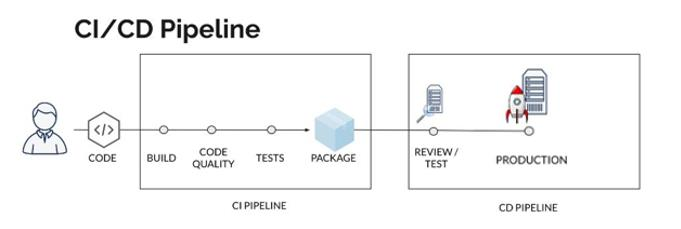
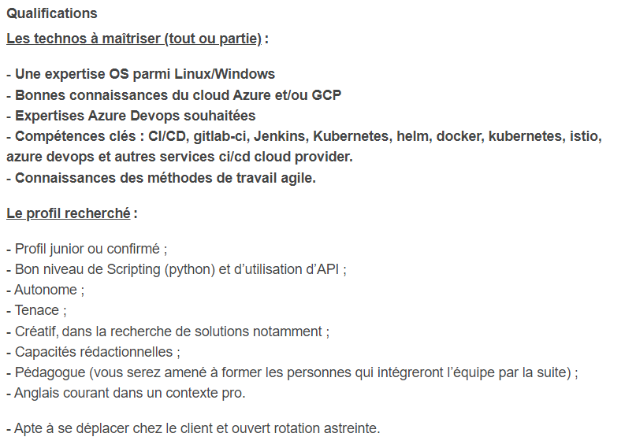

# PROJET FINAL DEVOPS

## I) Introduction

La société **IC GROUP** dans laquelle vous travaillez en tant qu’ingénieur Devops souhaite mettre sur
pied un site web vitrine devant permettre d’accéder à ses 2 applications phares qui sont :

1. Odoo
2. pgAdmin

Odoo, un ERP multi usage qui permet de gérer les ventes, les achats, la comptabilité, l’inventaire, le personnel ...
Odoo est distribué en version communautaire et Enterprise. ICGROUP souhaite avoir la main sur le code et
apporter ses propres modifications et customisations ainsi elle a opté pour l’édition communautaire. Plusieurs
versions de Odoo sont disponibles et celle retenue est la 13.0 car elle intègre un système de LMS (Learning
Management System) qui sera utilisé pour publier les formations en interne et ainsi diffuser plus facilement
l’information.
Liens utiles:

- Site officiel: <https://www.odoo.com/>
- GitHub officiel: <https://github.com/odoo/odoo.git>
- Docker Hub officiel: <https://hub.docker.com/_/odoo>

PgAdmin quant à elle devra être utilisée pour administrer de façon graphique la base de données PostgreSQL créée précédemment.
Liens utiles:

- Site officiel: <https://www.pgadmin.org/>
- Docker Hub officiel: <https://hub.docker.com/r/dpage/pgadmin4/>

Le site web vitrine a été conçu par l’équipe de développeurs de l’entreprise et les fichiers relatifs à cette application web se trouvent dans le repo suscité: <https://github.com/sadofrazer/ic-webapp.git>. Il est de votre responsabilité de conteneuriser cette application tout en permettant la saisie des différentes URLs des applications (Odoo et pgadmin) par le biais des variables d’environnement.
Ci-dessous un aperçu du site vitrine attendu.

NB : L’image créée devra permettre de lancer un conteneur permettant d’héberger ce site web et ayant les liens adéquats permettant d’accéder à nos applications internes.

## II) Conteneurisation de l’application web

Il s’agit en effet d’une application web python utilisant le module Flask. Les étapes à suivre pour la
conteneurisation de cette application sont les suivantes:

3. Image de base : python:3.6-alpine
4. Définir le répertoire /opt comme répertoire de travail
5. Installer le module Flask à l’aide de pip install
6. Exposer le port 8080 qui est celui utilisé par défaut par l'application
7. Créer les variables d’environnement ODOO_URL et PGADMIN_URL afin de permettre la définition de ces
   URLs lors du lancement du container
8. Lancer l’application app.py dans le ENTRYPOINT grâce à la commande python

Une fois le Dockerfile créé, buildez-le et lancer un conteneur test permettant d’aller sur les sites web officiels de chacune de ces applications (site web officiels fournis ci-dessus).

- Nom de l’image: ic-webapp;
- tag: 1.0
- container test_name: test-ic-webapp

Une fois le test terminé, supprimez ce container test et poussez votre image sur votre registre Docker hub.

## III) Partie 1 : Déploiement des différentes applications dans un cluster Kubernetes

### a. Architecture

Les applications ou services seront déployées dans un cluster Minikube, donc à un seul nœud et devront respecter l’architecture suivante.


En vous basant sur cette architecture logicielle, bien vouloir identifier en donnant le type et le rôle de chacune des ressources (A...H) mentionnées dans cette architecture.

### b. Déploiement de l’application Odoo

Comme décrite ci-dessus, Odoo est une application web de type 2 tier contenant différents modules
facilitant la gestion administrative d’une société.
En vous servant des différents liens mentionnés ci-dessus, déployer Odoo à l’aide des images docker
correspondantes et assurez-vous que les données de la base de données Odoo soient persistantes et
sauvegardées dans un répertoire de votre choix sur votre hôte.

**NB:** respectez l’architecture ci-dessus.

### c. Déploiement PgAdmin

Comme ci-dessus, servez-vous de la documentation de déploiement de PgAdmin sous forme de conteneur afin de déployer votre application.
Vous devez par la suite découvrir dans la documentation, le répertoire contenant les données et paramètres de l’application PgAdmin afin de le rendre persistant.
Notez également que PgAdmin est une application web d’administration des bases de données PostgreSQL,
Toutefois, le déploiement d’un container PgAdmin ne nécessite pas obligatoirement la fourniture des
paramètres de connexion à une BDD, donc vous pouvez initialement déployer l’interface web en fournissant le
minimum de paramètres requis (adresse mail + mot de passe) et ce n’est que par la suite par le biais de
l’interface graphique que vous initierez les différentes connexion à vos bases de données.
Afin de réduire le nombre de taches manuelles, nous souhaiterons qu’au démarrage de votre conteneur
PgAdmin, ce dernier ait automatiquement les données nécessaires lui permettant de se connecter à votre
BDD Odoo. Pour ce faire, il existe un fichier de configuration PgAdmin que vous devrez au préalable customiser et fournir par la suite à votre container sous forme de volume

Ce fichier doit être situé au niveau du conteneur dans le répertoire: **/pgadmin4/servers.json**

```json
{
  "Servers": {
    "1": {
      "Name": "Minimally Defined Server",
      "Group": "Server Group 1",
      "Port": 5432,
      "Username": "postgres",
      "Host": "localhost",
      "SSLMode": "prefer",
      "MaintenanceDB": "postgres"
    },
    "2": {
      "Name": "Minimally Defined Server",
      "Group": "Server Group 1",
      "Port": 5432,
      "Username": "postgres",
      "Host": "localhost",
      "SSLMode": "prefer",
      "MaintenanceDB": "postgres"
    }
  }
}
```

### d. Déploiement des différentes applications

En vous servant des données ci-dessus, créez les différents manifests correspondants aux ressources
nécessaires au bon fonctionnement de l’application tout en respectant l’architecture fournie (nombre de réplicas et persistance de données).
Notez également que l’ensemble de ces ressources devront être créées dans un namespace particulier appelé
*« icgroup »* et devront obligatoirement avoir toutes au moins le label *« env = prod »*

**NB:** Etant donné que vos manifests pourront être publics (pousser vers un repo Git), bien vouloir prendre les mesures nécessaires afin d’utiliser les ressources adéquates permettant de cacher vos informations sensibles.

### e. Test de fonctionnement et rapport final

Lancez l’exécution de vos différents manifests afin de déployer les différents services ou applications
demandés, testez le bon fonctionnement de vos différentes application et n’hésitez pas à prendre des captures d’écran le plus possible afin de consolider votre travail dans un rapport final qui présentera dans les moindres détails ce que vous avez fait.

## IV) Partie 2 : Mise en place d'un pipeline CI/CD à l'aide de JENKINS et de ANSIBLE

L'objectif de ICGROUP est en effet de mettre sur pied un pipeline CI/CD permettant l'intégration et le
déploiement en continu de cette solution sur leurs différentes machines en environnement de production (3
serveurs hébergés soit en On Premises soit dans le cloud AWS)

### a. Pipeline stages



### b. Infrastructure

Pour ce projet, on aura besoin de 3 serveurs hébergés soit dans le cloud ou en *On Premises* (VirtualBox,
VMWare...) pour ceux qui n’ont pas de compte cloud (AWS, AZURE ou autres).
Les serveurs nécessaires sont les suivants :

- Serveur 1 : Jenkins (AWS, t2.medium, docker_jenkins : <https://github.com/sadofrazer/jenkins-frazer.git>)
- Serveur 2 : Applications web site vitrine + pgadmin4 (AWS, t2.micro)
- Serveur 3 : Application Odoo (AWS, t2.micro)

### c. Automatisation du déploiement

Afin de faciliter le déploiement de nos applications dans notre pipeline Jenkins, nous allons créer des rôles ansible à
l’aide de l’IAC docker (Docker-compose) et Ansible.
Les étapes sont les suivantes:

1. Créer un docker-compose permettant de déployer entièrement l’application Odoo tout en créant un réseau docker et un volume pour faire persister les données de la BDD
2. Créer un docker-compose permettant de déployer l’application pgadmin avec les paramètres décrits dans la partie1 (fichier servers.json et persistance des données).
3. A l’aide de ces **docker-compose** comme Template, créer deux rôles **ansible** que vous appellerez odoo_role et pgadmin_role, dans ces rôles vous devez:

   i. Variabiliser le nom du réseau et du volume qui seront créés dans docker
   ii. Variabiliser le répertoire de montage pour le volume, permettant à l’utilisateur de définir s’il le souhaite un autre chemin de fichier en local sur son serveur où il souhaite stocker les données de la BDD Odoo
   iii. Variabiliser le nom des services et des containers qui seront créés par ce docker-compose.

**NB:** Ces rôles devront être appelés dans votre pipeline lors de la phase de déploiement avec les variabilisations qui vont bien.

### d. Mise en place du pipeline

Afin de davantage automatiser notre solution, vous devez créer à la racine de votre repo un fichier appelé
releases.txt dans lequel vous entrerez les données sur votre application (ODOO_URL, PGADMIN_URL et Version)
Ce fichier devra contenir 3 lignes et 2 colonnes (séparateur de colonne étant l’espace).

Exemple:


Par la suite, vous devez modifier votre Dockerfile afin qu’il puisse lors du build récupérer les valeurs des URLs du fichier **releases.txt** et les fournir automatiquement aux variables d’environnement créées dans le **Dockerfile**.
Cela devra se faire grâce aux commandes **awk** et **export**. Ci-dessous un exemple:


Après avoir créé le **Dockerfile** qui va bien, Vous devrez créer le **JenkinsFile** permettant de builder l’application, la tester (à vous de trouver les différents tests à réaliser sur chacune des applications) et la déployer en environnement de production.

**NB:** vous devrez utiliser les mêmes mécanismes afin de récupérer la valeur de la variable **version** dans le fichier **releases.txt** qui devra être utilisée comme tag sur votre image.

### e. Test de fonctionnement et rapport final

Lancez l’exécution de votre pipeline **manuellement** pour une première fois, ensuite **automatiquement** après modification de votre fichier releases.txt (version : 1.1). Vérifiez que toutes les applications sont déployées et fonctionnent correctement. N’hésitez pas à prendre des captures d’écran le plus possible afin de consolider votre travail dans un rapport final qui présentera dans les moindres détails ce que vous avez fait.

## V) ANNEXE

Ci-dessous un exemple de description des qualifications souhaitées pour un poste de Devops:



**NB:** Bien vouloir prêter attention aux qualités encadrées en jaune ci-dessus en jaune, vous vous
rendez compte en effet que maîtriser seulement les technologies ne suffit pas, il faut en plus de cela
avoir un *esprit très créatif*, de *très bonnes capacités rédactionnelles* pour rédiger vos différents
rapports et également des *qualités de pédagogue* qui vous aideront à parfaire les explications de vos
actions dans vos différents rapports afin de faciliter leur compréhension.

Compte tenu de tout cela, je vous invite tous à donner l’importance à ce volet **« rapport »** de votre
projet final, car c’est également une partie très importante qui devra pouvoir décrire le contenu de
l’ensemble de votre travail.

Merci de le rédiger correctement avec les **captures d’écran**, **commentaires** et **explications** qui vont bien car cette partie sera prise en compte dans votre note finale.
